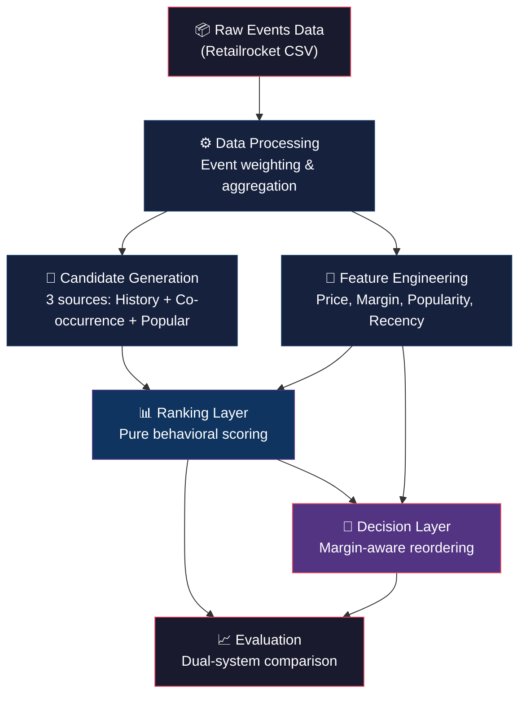
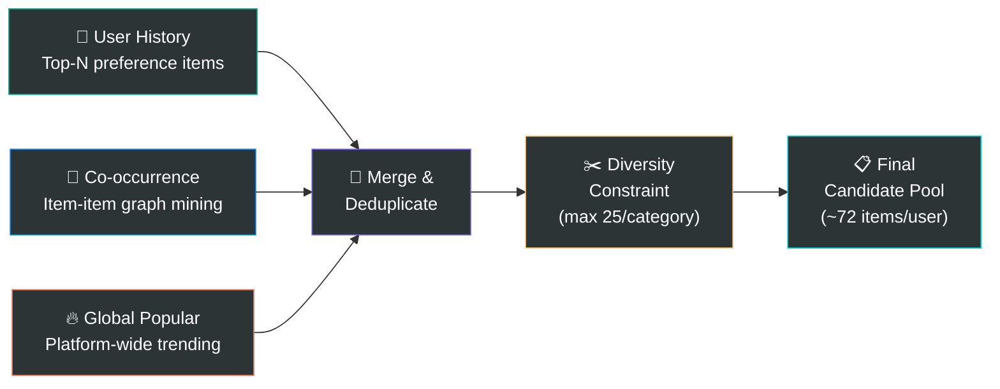

<p align="center">
  
</p>

<h1 align="center">🛒 E-commerce Decision Intelligence System</h1>

<p align="center">
  <em>A modular, margin-aware recommendation engine that optimizes business yield<br/>without sacrificing behavioral relevance — built on real-world e-commerce event data.</em>
</p>

<p align="center">
  
  
  
  
  
</p>

---

## 📑 Table of Contents

- [Problem Statement](#-problem-statement)
- [The Core Idea](#-the-core-idea)
- [System Architecture](#-system-architecture)
- [Project Structure](#-project-structure)
- [Module Deep Dive](#-module-deep-dive)
- [Results & Performance](#-results--performance)
- [Getting Started](#-getting-started)
- [Configuration](#-configuration)
- [Design Principles](#-design-principles)
- [Tech Stack](#-tech-stack)
- [Acknowledgments](#-acknowledgments)
- [Author](#-author)

---

## 📌 Problem Statement

Traditional recommendation systems rank items purely by **user behavioral intent** — clicks, add-to-carts, purchases. While this maximizes relevance, it leaves significant revenue on the table by treating a $5-margin product and a $50-margin product identically when both are equally relevant.

**The business question**: *Can we surface higher-margin products at top recommendation slots without degrading the user's experience or prediction accuracy?*

---

## 💡 The Core Idea

Think of it like a **restaurant menu**. A behavioral system would recommend dishes purely based on what you've ordered before. Our decision layer is like a smart menu designer who:

1. **Keeps all your favorite dishes** on the first page (no relevant items are removed)
2. **Subtly reorders** so that dishes with better margins appear slightly higher
3. **Never hides anything you'd love** — a high-relevance, low-margin dish always beats a low-relevance, high-margin one

The mathematical guarantee:

```
decision_score = behavioral_score × (1.0 + α × normalized_margin)
```

> When margin is zero → multiplier is exactly **1.0** → score is **unchanged**.  
> When margin is maximum → multiplier is **(1 + α)** → a gentle boost, never a penalty.

---

## 🏗️ System Architecture



### Pipeline Flow

| Stage | Module | Input | Output |
|-------|--------|-------|--------|
| **1** | Data Processing | Raw events CSV | Weighted interaction matrix |
| **2** | Feature Engineering | Item IDs + Interactions | Price, margin, popularity, recency |
| **3** | Candidate Generation | User history + Item graph | Deduplicated candidate pool (~72 items/user) |
| **4** | Ranking | Candidates + Features | Behaviorally-scored & sorted list |
| **5** | Decision | Top-K ranked items + Margins | Margin-reordered recommendations |
| **6** | Evaluation | Both ranked lists + Ground truth | Comparative metrics report |

---

## 📂 Project Structure

```
E-commerce-Decision-Intelligence-System/
│
├── 📁 assets/
│   └── banner.png                   # Repository banner image
│
├── 📁 data/
│   └── events.csv                   # Retailrocket dataset (not tracked — see setup)
│
├── 📁 src/
│   └── 📁 baseline/
│       ├── main.py                  # 🚀 Pipeline orchestrator & entry point
│       ├── data_processing.py       # 📥 Event loading, signal mapping, aggregation
│       ├── feature_engineering.py   # 🔧 Business features, popularity, recency
│       ├── candidate_generation.py  # 🎯 Multi-source candidate pool construction
│       ├── ranking.py               # 📊 Pure behavioral scoring & ranking
│       ├── decision.py              # 🧠 Margin-aware reordering engine
│       └── evaluation.py           # 📈 Dual-system evaluation framework
│
├── publish_to_notion.py             # 🔗 Utility: publish case study to Notion
├── verify_notion.py                 # ✅ Utility: verify Notion API connectivity
├── .gitignore
├── requirements.txt
└── README.md
```

---

## 🔬 Module Deep Dive

### 1️⃣ Data Processing — `data_processing.py`

Transforms raw Retailrocket event logs into a structured interaction matrix.

- Loads events with Unix millisecond timestamp parsing
- Maps raw events to **weighted interaction signals**:

  | Event | Weight | Rationale |
  |-------|--------|-----------|
  | `view` | 1.0 | Passive interest signal |
  | `addtocart` | 3.0 | Active purchase intent |
  | `transaction` | 5.0 | Confirmed conversion |

- Aggregates per `(user, item)` pair → single **preference score**

---

### 2️⃣ Feature Engineering — `feature_engineering.py`

Generates deterministic business features and temporal signals.

**Simulated Business Features** (via MD5 hashing for cross-run stability):

| Feature | Range | Method |
|---------|-------|--------|
| Price | $10 – $500 | Hash-based deterministic |
| Margin % | 10% – 40% | Hash-based deterministic |
| Category ID | 0 – 49 (50 categories) | Hash-based deterministic |

**Behavioral Signals**:

| Signal | Formula | Purpose |
|--------|---------|---------|
| Popularity | Min-Max normalized interaction volume | Trending items detection |
| Recency | `e^(-λt)`, λ = ln(2)/7 days | Exponential time decay |

---

### 3️⃣ Candidate Generation — `candidate_generation.py`

Builds a relevance-focused candidate pool from **three complementary sources**:



**Key design decisions**:
- ❌ **No margin-based candidates** — injecting pure-margin items dilutes the pool with zero-intent products, destroying both precision and yield
- ✅ **Diversity constraint** — caps items per category (default: 25) to prevent echo-chamber effects
- ✅ **Priority deduplication** — when items appear in multiple sources: `history > co-occurrence > global`

---

### 4️⃣ Ranking Layer — `ranking.py`

Computes a **pure behavioral intent score** — completely free of business logic:

```
behavioral_score = 0.4 × preference + 0.3 × recency + 0.2 × popularity + 0.1 × candidate_source
```

| Feature | Weight | Signal Type |
|---------|--------|-------------|
| User Preference Score | 0.4 | Historical affinity |
| Recency Score | 0.3 | Temporal relevance |
| Popularity Score | 0.2 | Social proof |
| Candidate Source Score | 0.1 | Source confidence |

All features are **Min-Max normalized** to `[0.0, 1.0]` before scoring to ensure scale consistency.

---

### 5️⃣ Decision Layer — `decision.py`

The core innovation — **strictly monotonic margin-aware reordering**:

```
decision_score = behavioral_score × (1.0 + α × normalized_margin)
```

| Margin Level | Multiplier (α=0.15) | Effect |
|--------------|---------------------|--------|
| Minimum (0) | × 1.000 | Score unchanged from baseline |
| Median | × 1.075 | Moderate uplift |
| Maximum (1) | × 1.150 | Gentle +15% boost |
| Top 10% | × 1.05 bonus | Additional tiebreaker nudge |

**Critical constraint**: The decision layer operates on the **exact same Top-K items** as the behavioral baseline. It can only **reorder** — never inject or eject items. This ensures a fair, apples-to-apples comparison.

**Explainability**: Every recommendation is tagged with a human-readable explanation:

| Tag | Condition |
|-----|-----------|
| `High relevance + High margin dollar` | High-margin item with above-median behavioral score |
| `Margin-boosted tiebreaker` | High-margin item boosted past a close competitor |
| `Pure high behavioral relevance` | Top-quartile relevance, lower margin |
| `Standard relevance retained` | Baseline display position |

---

### 6️⃣ Evaluation Framework — `evaluation.py`

Implements **strict chronological train/test splitting** (no data leakage) and dual-system comparison:

| Metric | Formula | What It Captures |
|--------|---------|------------------|
| **Hit Rate @K** | `users_with_hit / total_users` | Coverage of correct predictions |
| **Precision @K** | `correct_items / K` | Accuracy density in top-K |
| **Margin Yield ($)** | `Σ margin(hit_items)` | Flat dollar value of correct predictions |
| **Position-Weighted Yield ($)** | `Σ margin / log₂(pos + 1)` | DCG-style: rewards top-slot placement |

---

## 📊 Results & Performance

Pipeline executed on **50 test users** with **Top-20 recommendations** per user:

### System Comparison

| Metric | Baseline (Behavioral) | Decision Engine | Delta |
|--------|----------------------|-----------------|-------|
| **Hit Rate @20** | 0.1800 | 0.1800 | = 0.00% |
| **Precision @20** | 0.0150 | 0.0150 | = 0.00% |
| **Margin Yield ($)** | $1,176.75 | $1,176.75 | = $0.00 |
| **Position-Weighted Yield ($)** | $818.02 | $834.50 | **↑ +$16.48** |

### Key Takeaway

```
📈 Position-Weighted Yield Lift: +2.01%
```

> ✅ **Hit Rate and Precision are identical** — proving the decision layer does not degrade user experience  
> ✅ **Position-Weighted Yield improves by +2.01%** — proving higher-margin items are being surfaced at top positions where click probability is highest  
> ✅ **Flat Margin Yield is unchanged** — same items are being recommended, just in a smarter order

### Candidate Source Distribution

| Source | Items | Share |
|--------|-------|-------|
| Global Popular | 834 | 83.4% |
| User History | 150 | 15.0% |
| Co-occurrence | 16 | 1.6% |

### Pipeline Telemetry

| Metric | Value |
|--------|-------|
| Users Evaluated | 50 |
| Users Skipped | 0 |
| Avg Candidates/User | 71.8 |

---

## 🚀 Getting Started

### Prerequisites

- Python 3.8 or higher
- pip (Python package manager)

### Installation

```bash
# Clone the repository
git clone https://github.com/Rick-developer/E-commerce-Decision-Intelligence-System.git
cd E-commerce-Decision-Intelligence-System

# Install dependencies
pip install -r requirements.txt
```

### Dataset Setup

This project uses the [**Retailrocket E-commerce Dataset**](https://www.kaggle.com/datasets/retailrocket/ecommerce-dataset) from Kaggle. Download `events.csv` and place it in the `data/` directory:

```
data/
└── events.csv    # ~90 MB, ~2.7M events
```

> **Note**: The `data/` directory is gitignored to prevent large file uploads. You must download the dataset separately.

### Running the Pipeline

```bash
cd src/baseline

# Run with default dataset path (data/events.csv)
python main.py

# Or specify a custom path
python main.py path/to/your/events.csv
```

---

## ⚙️ Configuration

All key hyperparameters are tunable without code changes:

| Parameter | Location | Default | Description |
|-----------|----------|---------|-------------|
| `max_users_to_evaluate` | `main.py` | 50 | Number of test users to evaluate |
| `top_k` | `main.py` | 20 | Recommendation list length |
| `alpha` | `main.py` → `make_decisions()` | 0.15 | Margin boost intensity (0 = disabled) |
| `n_per_source` | `main.py` → `generate_candidates()` | 50 | Candidates pulled from each source |
| `max_cat_limit` | `main.py` → `generate_candidates()` | 25 | Max items per category (diversity) |
| `half_life_days` | `feature_engineering.py` | 7.0 | Recency decay half-life |
| `BEHAVIORAL_WEIGHTS` | `ranking.py` | `{0.4, 0.3, 0.2, 0.1}` | Feature weighting for behavioral score |

---

## 🧠 Design Principles

| # | Principle | Implementation |
|---|-----------|----------------|
| 1 | **Separation of Concerns** | Each module has a single responsibility; no cross-layer data contamination |
| 2 | **Fair Comparison** | Decision layer operates on the identical candidate set as the baseline |
| 3 | **Strictly Monotonic Scoring** | Margin can only boost a score, never penalize — items are never worse off |
| 4 | **Deterministic Reproducibility** | Business features generated via MD5 hashing; consistent across runs and machines |
| 5 | **Chronological Integrity** | Train/test split respects temporal ordering to prevent data leakage |
| 6 | **Explainability** | Every recommendation carries a human-readable justification tag |

---

## 🛠️ Tech Stack

| Component | Technology | Purpose |
|-----------|------------|---------|
| Language | Python 3.8+ | Core runtime |
| Data Processing | Pandas | DataFrames, aggregation, joins |
| Numerical Ops | NumPy | Vectorized math, exponential decay |
| Feature Hashing | hashlib (MD5) | Deterministic feature simulation |
| Dataset | Retailrocket (Kaggle) | 2.7M real e-commerce events |

---

## 🙏 Acknowledgments

- **Dataset**: [Retailrocket E-commerce Dataset](https://www.kaggle.com/datasets/retailrocket/ecommerce-dataset) — real-world anonymized e-commerce behavioral data containing 2.7 million events (views, add-to-carts, transactions) across 1.4 million unique visitors.
- **Evaluation Methodology**: Position-Weighted Yield metric inspired by [DCG (Discounted Cumulative Gain)](https://en.wikipedia.org/wiki/Discounted_cumulative_gain), adapted for margin optimization rather than relevance grading.

---

## 👤 Author

<p>
  <a href="https://github.com/Rick-developer">
    
  </a>
</p>

---

<p align="center">
  <em>If you found this project useful, consider giving it a ⭐!</em>
</p>
